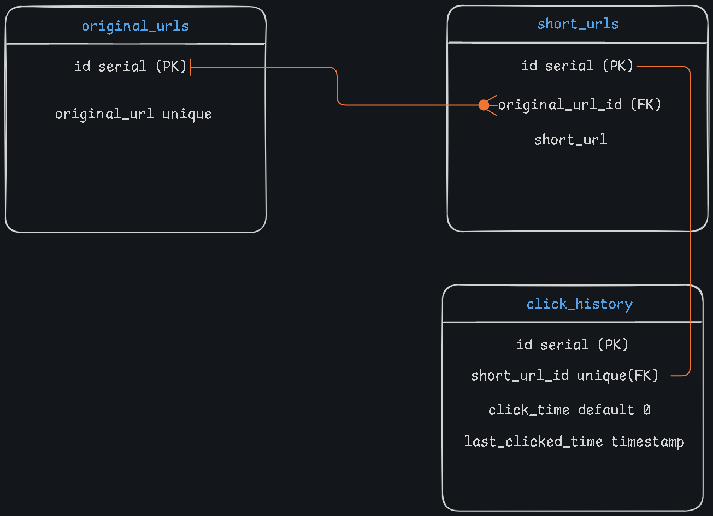

# URL-SHORT

## brute force method
- go into each root directory of each folder
- open terminal
- run `npm install`
- in root directory UI folder run `npm run dev`
- in root directory of each service folder run `node server.js`

## using docker
- run `docker-compose build`

## Architecture Diagram

## Database ER Diagram

## Data Flow Diagram

